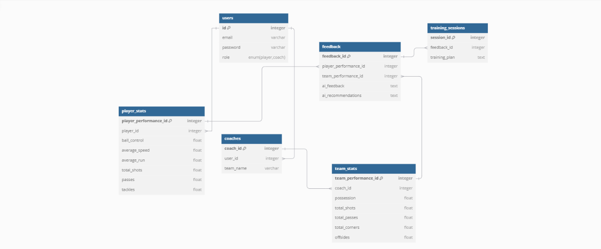

<br><br>

<!-- project philosophy -->


>  A website for football academies that provides AI-powered analysis of uploaded gameplay clips. Coaches and players can use this platform to review their performance and identify areas for improvement.


### User Stories
#### Players

- As a player,I want to check individual player performance, so that I can understand my strengths and weaknesses.

- As a player,I want to receive detailed feedback from AI about the game,so that I can learn from my mistakes and improve my gameplay.

- As a player,I want to receive personalized training sets from AI based on my performance,so that I can effectively target areas for improvement.

#### Coaches

- As a coach,I want to check overall team performance,so that I can assess the team's strengths and weaknesses.

- As a coach,I want to get detailed feedback from AI about the game, so that I can identify areas for improvement for the team as a whole.

- As a coach,I want to receive AI-suggested sets of training for overall team improvement,so that I can effectively plan and conduct training sessions to address team needs.

<br><br>
<!-- Tech stack -->


###  AIPRO is built using the following technologies:

- This project uses the [Next.js](https://nextjs.org/) framework for the frontend. Next.js is a React-based web development framework that allows for server-side rendering, static site generation, and optimized performance for web applications.
- The backend is powered by [Django](https://www.djangoproject.com/), a high-level Python web framework known for its robustness and scalability. Django is used to handle API requests, manage user authentication, and orchestrate the AI-powered analysis workflows.
- For persistent storage, the project uses a [MySQL](https://www.mysql.com/) database. MySQL is a reliable and efficient relational database system that stores user data, gameplay analysis results, and training recommendations.
- The AI-driven analysis leverages advanced machine learning models to provide players and coaches with actionable insights, detailed game performance feedback, and personalized training recommendations for improvement.
- The platform follows modern design principles, ensuring an intuitive and user-friendly experience for both players and coaches.

<br><br>
<!-- UI UX -->


> We designed the football analysis platform using wireframes and mockups, iterating on the design until we achieved an intuitive layout that ensures seamless navigation and a user-friendly experience for players and coaches.

- Project Figma design [figma](https://www.figma.com/design/ZAy6TOinYUcO0aj3j9E5T0/Untitled?node-id=0-1&p=f&t=xAyXD9uoC30yY66z-0)


### Mockups
| Result screen  | Menu Screen |
| ---| ---|
<!-- |  |   -->

<br><br>
<!-- Database Design -->


###  Architecting Data Excellence: Innovative Database Design Strategies:

- 


<br><br>

<!-- Implementation -->


### Admin Screens (Web)
| Login screen  | Register screen |  Home screen |
| ---| ---| ---|
|  |  |  |
| Workflow screen  | Updates Screen  | Clients Screen  |
|  |  |  |
| Feedback screen  | Footer Screen  | Upload Screen  |
|  |  |  |
| Character screen  | Player Screen  | Team Screen  |
|  |  |  |
| Player Stats screen  | Coach Stats Screen  | Analyzer Screen  |
|  |  |  |
| Program screen  | Saving Stats Screen  | Saved Stats Screen  |
|  |  |  |

<br><br>


> This is an example of how you may give instructions on setting up your project locally.
To get a local copy up and running follow these simple example steps.
### Prerequisites

This is an example of how to list things you need to use the software and how to install them.
* npm
  ```sh
  npm install 
  ```

### Installation

_Below is an example of how you can instruct your audience on installing and setting up your Website. This template doesn't rely on any external dependencies or services._

1. Clone the repo
   ```sh
   git clone https://github.com/gabykassab00/AIPRO
   ```
2. Install NPM packages
   ```sh
   npm install
   ```
3. Run Next.js app`
   ```js
   npm run dev ;
   ```
4. Install Django`
   ```js
   pip install django ;
   ```
5. Run Django`
   ```js
   python manage.py runserver ;
   ```


